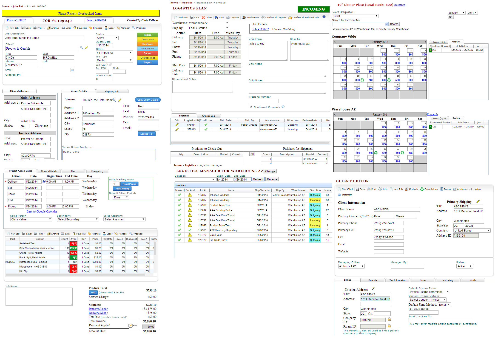
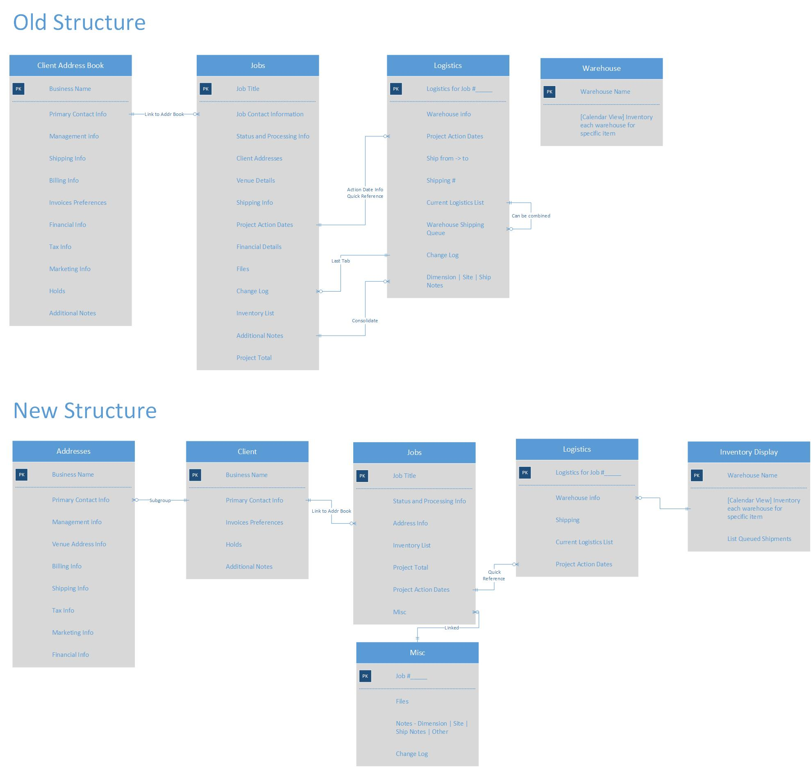
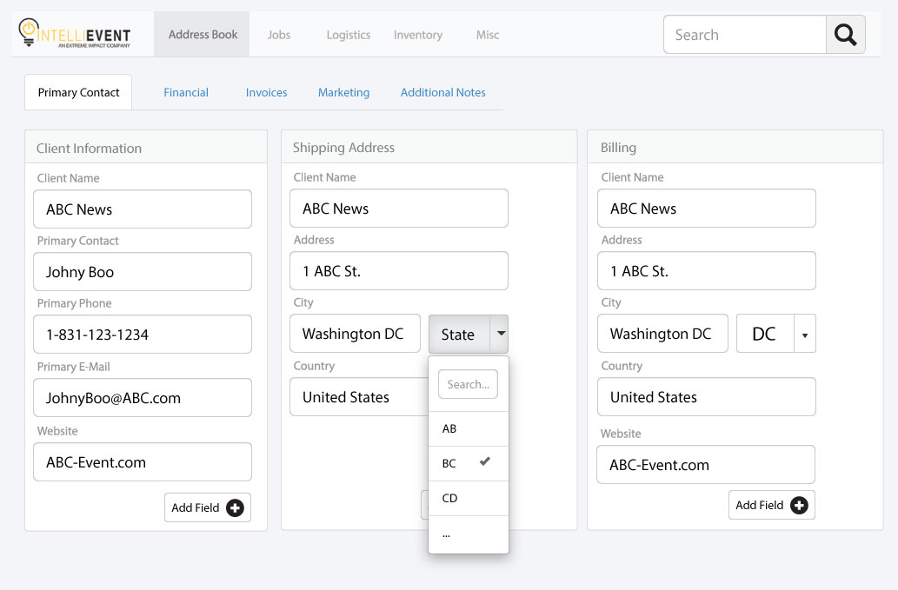
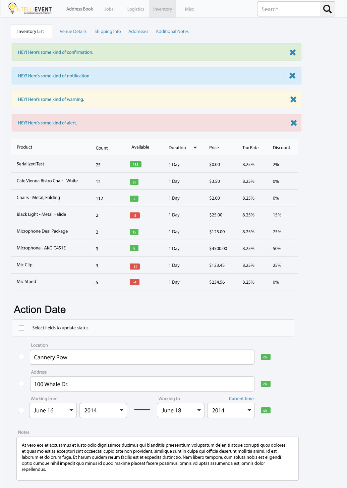

IntelliEvent
============

## Introduction

I was hired by a local software company to review and update the interface for a cloud-based inventory management app.

## Screenshots

### The current application screens

### The information architecture of the application

### A sample form

### Alerts, table styling, and calendar UI

## Interface updates:
* Clearer typography
* Responsive site design with ease of use in mind
* Faster workflow and macro options
* Varying color schemes
* Significantly faster resource load times

## Tools

Built using Photoshop